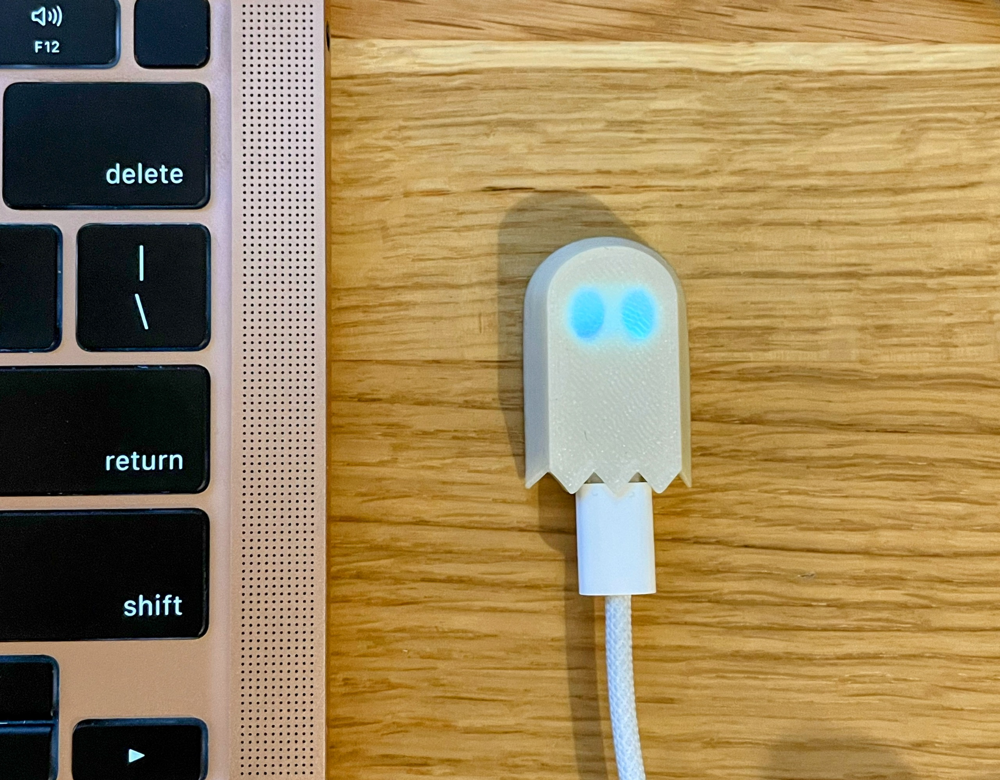
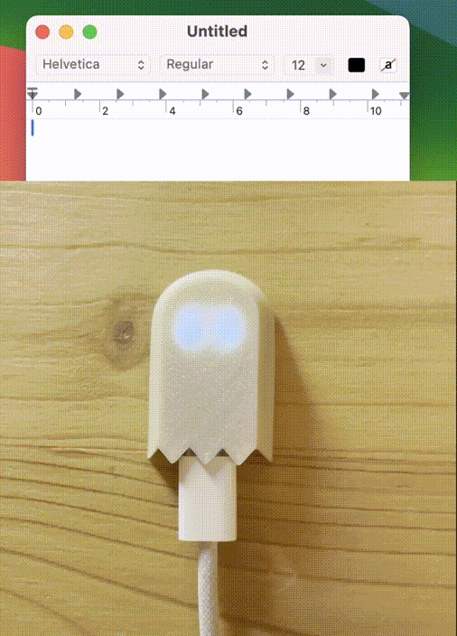

<!-- Improved compatibility of back to top link: See: https://github.com/othneildrew/Best-README-Template/pull/73 -->
<a id="readme-top"></a>

<!--
README from https://github.com/othneildrew/Best-README-Template/tree/main
Adapted where relevant.
-->

<!-- PROJECT LOGO -->
<br />
<div align="center">
  <a href="https://github.com/nmattia/ghostwriter">
    
  </a>

  <h3 align="center">Ghostwriter</h3>

  <p align="center">
    A 3D-printed, 1-key keyboard based on the <a href="https://shop.pimoroni.com/products/tiny-2040">Tiny 2040</a>, with customizable <a href="https://www.rust-lang.org">Rust</a> firmware.
    <br />
    <a href="https://github.com/nmattia/ghostwriter#getting-started"><strong>Getting Started »</strong></a>
    <br />
    <br />
    <a href="https://www.printables.com/model/1055689-ghostwriter-usb-macropad">Printables Page</a>
        ·
    <a href="https://github.com/nmattia/ghostwriter/issues/new">Report Bug</a>
        ·
    <a href="https://cad.onshape.com/documents/5380da1daf1adb7ecfc899db/w/b6aa2025c0e95218301ba104/e/591c8ed175a0952e497c7e59?renderMode=0&uiState=671e85af930e803261c8c26f">Onshape Project</a>
    <br/>
    <br/>
    Built with:
    <br/>
    <a href="https://www.raspberrypi.com/products/rp2040/">
        
    </a>
    <a href="https://www.rust-lang.org">
        
    </a>
    <a href="https://onshape.com">
        
    </a>
  </p>
</div>


<!-- TABLE OF CONTENTS -->
<details>
  <summary>Table of Contents</summary>
  <ol>
    <li>
      <a href="#about-the-project">About The Project</a>
    </li>
    <li>
      <a href="#getting-started">Getting Started</a>
      <ul>
        <li><a href="#prerequisites">Prerequisites</a></li>
        <li><a href="#installing-the-firmware">Installing the Firmware</a></li>
      </ul>
    </li>
    <li><a href="#building">Building</a></li>
    <li><a href="#contact">Contact</a></li>
    <li><a href="#acknowledgments">Acknowledgments</a></li>
  </ol>
</details>

<!-- ABOUT THE PROJECT -->
## About The Project

<br/>
<br/>
<br/>

<p align="center"></p>

<br/>
<br/>
<br/>

The Ghostwriter is a small, customizable macro pad based on the [Tiny 2040][tiny-2040] development board (with RaspberryPi rp2040 inside).

It has a single button — can be used to write a letter, start a macro, etc — and an LED for feedback. It connects through USB-C and shows up as a USB device.

Everything (from the LED color and blinking patterns, button actions, USB product display name) is configurable in the source code. Some pre-built firmwares are also available (see [Getting Started](#getting-started)).

<p align="right">(<a href="#readme-top">back to top</a>)</p>

<!-- GETTING STARTED -->
## Getting Started

To install the `lorem` firmware — spitting out lorem ipsum on the press of a button — follow the next steps.

<br/>
<br/>

<p align="center"></p>


> [!NOTE]
> These instructions focus on the Firmware. For instructions on how to 3D print the
> Ghostwriter case please refer to the [Printables page][printables-ghostwriter].

### Prerequisites

In order to install the firmware (`lorem`) you need:

* A [Tiny 2040][tiny-2040] microcontroller board.
<!-- TODO: add printables link
2. (optional) A 3D-printed [Ghostwriter case][printables-ghostwriter].
-->

### Installing the Firmware

1. Download the `lorem.uf2` firmware from the [Release page][releases].
2. Press the `boot` button of the Tiny 2040 and (with the `boot` button pressed) connect it to your computer via USB. **NOTE**: If you have printed the [Ghostwriter case][printables-ghostwriter], the `boot` button is the (one and only) button pressed when you squeeze the case.
3. Verify that the Tiny 2040 is mounted as removable storage.
4. Drag and drop the `lorem.uf2` firmware to the removable storage volume.
5. **SUCCESS!** The Tiny 2040 reboots and loads the firmware.

The eyes (the LED) should be green and blinking slowly. Open a text editor and press the `boot` button (or squeeze the case). The eyes are now lavender-pink and blinking fast. The Ghostwriter is writing to your text editor. The Ghostwriter will keep writing (potentially starting the [lorem ipsum](https://loremipsum.io) over) until you press it again.

See the [Building](#building) section for instructions on how to build and tweak the code yourself.

<p align="right">(<a href="#readme-top">back to top</a>)</p>


<!-- BUILDING INSTRUCTIONS -->

## Building

Make sure you have a recent vesion of Rust installed, as well as the right target for the `rp2040`:

```bash
rustup self update
rustup update stable
rustup target add thumbv6m-none-eabi
```

Install the `flip-link` linker (for defmt & stackoverflow protection):

```
cargo install flip-link
```

Build the `lorem` firmware:

```
cargo build --release --bin lorem
```

Make sure [elf2uf2-rs](https://github.com/JoNil/elf2uf2-rs) is installed. Then deploy the firmware to the Tiny 2040 (ensure the device is connect and in boot mode, i.e. `boot` was pressed when plugging the device):

> [!NOTE]
> The command below uses the `runner` specified in `.cargo/config` to convert the cargo-built ELF file to uf2 and deploy it to the connected Tiny 2040.

```
cargo install elf2uf2-rs
cargo run --release --bin lorem
```

<p align="right">(<a href="#readme-top">back to top</a>)</p>

<!-- CONTACT -->
## Contact

[Nicolas Mattia][nmattia.com] - [@nasmattia](https://twitter.com/nasmattia) - nicolas@nmattia.com

Project Link: [https://github.com/nmattia/ghostwriter](https://github.com/nmattia/ghostwriter)

<p align="right">(<a href="#readme-top">back to top</a>)</p>


<!-- ACKNOWLEDGMENTS -->
## Acknowledgments

* [rust-embedded](https://github.com/rust-embedded) and their great guides & libraries
* [Pimoroni](https://shop.pimoroni.com) and [RaspberryPi Foundation](https://www.raspberrypi.com) for producing super cool hardware
* [Onshape][onshape-url] for CAD done right
* [Prusa](https://www.prusa3d.com) and the [Voron team](http://vorondesign.com) for making and designing great printers
* [Othneil Drew's README template](https://github.com/othneildrew/Best-README-Template)

<p align="right">(<a href="#readme-top">back to top</a>)</p>

<!-- MARKDOWN LINKS & IMAGES -->
<!-- https://www.markdownguide.org/basic-syntax/#reference-style-links -->
[rp2040]: https://img.shields.io/badge/rp2040-DDDDDD?style=for-the-badge&logo=raspberrypi&logoColor=red
[rp2040-url]: https://www.raspberrypi.com/products/rp2040/
[rust]: https://img.shields.io/badge/rust-f59042?style=for-the-badge&logo=rust&logoColor=grey
[rust-url]: https://www.rust-lang.org
[onshape]: https://img.shields.io/badge/onshape-000000?style=for-the-badge&logo=data:image/svg%2bxml;base64,PHN2ZyBpZD0iZU1vOThjemhwR1QxIiB4bWxucz0iaHR0cDovL3d3dy53My5vcmcvMjAwMC9zdmciIHhtbG5zOnhsaW5rPSJodHRwOi8vd3d3LnczLm9yZy8xOTk5L3hsaW5rIiB2aWV3Qm94PSIwIDAgNDggNDgiIHNoYXBlLXJlbmRlcmluZz0iZ2VvbWV0cmljUHJlY2lzaW9uIiB0ZXh0LXJlbmRlcmluZz0iZ2VvbWV0cmljUHJlY2lzaW9uIiBwcm9qZWN0LWlkPSJkYmIyOGQyNDM4YzA0NGI4OGM0ZDQyYTkwMmIyYjk2OCIgZXhwb3J0LWlkPSI5NDlhMjkwZTk5NDM0NGUxOWVkNzM2OTdkY2JlZWI0NSIgY2FjaGVkPSJmYWxzZSI+PGcgdHJhbnNmb3JtPSJtYXRyaXgoMS4xMzEgMCAwIDEuMTMxMDAxLTMuMTQ0LTMuMTQ0MDI0KSI+PHBvbHlnb24gcG9pbnRzPSI2LjI0NjUsMTMuNzUgNi4yNDY1LDM0LjI1IDI0LDQ0LjUgNDEuNzUzNSwzNC4yNSA0MS43NTM1LDEzLjc1IDI0LDMuNSA2LjI0NjUsMTMuNzUiIGZpbGw9IiM3YmRhNmMiIHN0cm9rZT0iIzAwMCIgc3Ryb2tlLWxpbmVjYXA9InJvdW5kIiBzdHJva2UtbGluZWpvaW49InJvdW5kIi8+PHBvbHlnb24gcG9pbnRzPSIxMy4xNzQ3LDE3Ljc1IDEzLjE3NDcsMzAuMjUgMjQsMzYuNSAzNC44MjUzLDMwLjI1IDM0LjgyNTMsMTcuNzUgMjQsMTEuNSAxMy4xNzQ3LDE3Ljc1IiBmaWxsPSIjZmRmZGZkIiBzdHJva2U9IiMwMDAiIHN0cm9rZS1saW5lY2FwPSJyb3VuZCIgc3Ryb2tlLWxpbmVqb2luPSJyb3VuZCIvPjxwb2x5Z29uIHBvaW50cz0iMTYuNjM4OCwxOS43NSAxNi42Mzg4LDI4LjI1IDI0LDMyLjUgMzEuMzYxMiwyOC4yNSAzMS4zNjEyLDE5Ljc1IDI0LDE1LjUgMTYuNjM4OCwxOS43NSIgZmlsbD0iIzk1OTM5MyIgc3Ryb2tlPSIjMDAwIiBzdHJva2UtbGluZWNhcD0icm91bmQiIHN0cm9rZS1saW5lam9pbj0icm91bmQiLz48cG9seWdvbiBwb2ludHM9IjE5LjY2OTksMjEuNSAxOS42Njk5LDI2LjUgMjQsMjkgMjguMzMwMSwyNi41IDI4LjMzMDEsMjEuNSAyNCwxOSAxOS42Njk5LDIxLjUiIGZpbGw9IiNmZmYiIHN0cm9rZT0iIzAwMCIgc3Ryb2tlLWxpbmVjYXA9InJvdW5kIiBzdHJva2UtbGluZWpvaW49InJvdW5kIi8+PGxpbmUgeDE9IjM0LjgyNTMiIHkxPSIzMC4yNSIgeDI9IjM0LjgyNTMiIHkyPSIzOC4yNSIgZmlsbD0ibm9uZSIgc3Ryb2tlPSIjMDAwIiBzdHJva2UtbGluZWNhcD0icm91bmQiIHN0cm9rZS1saW5lam9pbj0icm91bmQiLz48bGluZSB4MT0iMjguMzMwMSIgeTE9IjI2LjUiIHgyPSIyOC4zMzAxIiB5Mj0iMzAiIGZpbGw9Im5vbmUiIHN0cm9rZT0iIzAwMCIgc3Ryb2tlLWxpbmVjYXA9InJvdW5kIiBzdHJva2UtbGluZWpvaW49InJvdW5kIi8+PGxpbmUgeDE9IjI0IiB5MT0iMTEuNSIgeDI9IjMwLjkyODIiIHkyPSI3LjUiIGZpbGw9Im5vbmUiIHN0cm9rZT0iIzAwMCIgc3Ryb2tlLWxpbmVjYXA9InJvdW5kIiBzdHJva2UtbGluZWpvaW49InJvdW5kIi8+PGxpbmUgeDE9IjEzLjE3NDciIHkxPSIzMC4yNSIgeDI9IjYuMjQ2NSIgeTI9IjI2LjI1IiBmaWxsPSJub25lIiBzdHJva2U9IiMwMDAiIHN0cm9rZS1saW5lY2FwPSJyb3VuZCIgc3Ryb2tlLWxpbmVqb2luPSJyb3VuZCIvPjxsaW5lIHgxPSIyNy4wMzExIiB5MT0iMTcuMjUiIHgyPSIyNCIgeTI9IjE5IiBmaWxsPSJub25lIiBzdHJva2U9IiMwMDAiIHN0cm9rZS1saW5lY2FwPSJyb3VuZCIgc3Ryb2tlLWxpbmVqb2luPSJyb3VuZCIvPjxsaW5lIHgxPSIxNi42Mzg4IiB5MT0iMjQuNzUiIHgyPSIxOS42Njk5IiB5Mj0iMjYuNSIgZmlsbD0ibm9uZSIgc3Ryb2tlPSIjMDAwIiBzdHJva2UtbGluZWNhcD0icm91bmQiIHN0cm9rZS1saW5lam9pbj0icm91bmQiLz48L2c+PC9zdmc+DQo=

[onshape-url]: https://onshape.com

[releases]: https://github.com/nmattia/ghostwriter/releases


[printables-ghostwriter]: https://www.printables.com/model/1055689-ghostwriter-usb-macropad

[nmattia.com]: https://nmattia.com

[tiny-2040]: https://shop.pimoroni.com/products/tiny-2040
